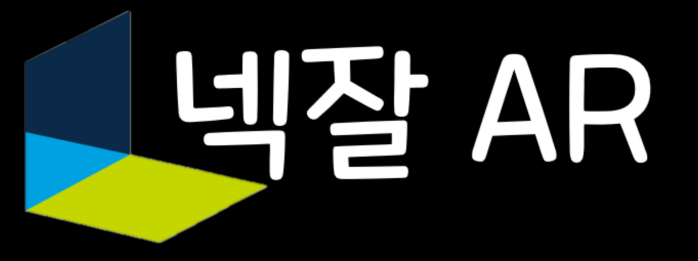

# 넥잘AR

> **넥슨 게임 IP를 활용한 AR필터를 제공하는 어플리케이션**

<div align="center" style="text-align: center">


</div>

<div align="center" style="text-align: center">

</div>

## 개요

> 기존의 AR필터 어플리케이션에 넥슨 게임 IP를 접목하여 10대, 20대 여성들에게 귀엽고 재미있는 경험을 제공해 줄 수 있는 솔루션을 구현하였습니다.

## Preview

<div align="center" style="text-align: center">


</div>

## Folder

```
.\
|-- porting_manual\
|  |-- 포팅_메뉴얼.pdf
|-- ReadmeSrc\
|-- Unity\
```

## 소개 자료

프로젝트를 한눈에 보기 쉽게 정리해놓은 PDF 파일

```
.\
|-- ReadmeSrc\
|  |-- 소개자료.pdf
```

## Porting Manual

포팅을 위한 메뉴얼

```
.\
|-- porting_manual\
|  |-- 포팅_메뉴얼.pdf
```

## Team

| 이름   | github                                          | 역할  | 비고   |
| ------ | ----------------------------------------------- | ----- | ------ |
| 서권우 | [sz5656](https://github.com/sz5656)             | Unity | Leader |
| 유시진 | [YooSijin9461](https://github.com/YooSijin9461) | Unity | -      |
| 최민수 | [neverte](https://github.com/neverte)           | Unity | -      |

## Licences

#### AR Foundation

```Licences
AR Foundation © 2018 Unity Technologies

Licensed under the Unity Companion License for Unity-dependent projects (see Unity Companion License).

Unless expressly provided otherwise, the Software under this license is made available strictly on an “AS IS” BASIS WITHOUT WARRANTY OF ANY KIND, EXPRESS OR IMPLIED. Please review the license for details on these and other terms and conditions.
```

#### AR Core

https://github.com/google-ar/arcore-android-sdk/blob/master/LICENSE

#### NatCorder

```Licences
MIT License

Copyright (c) 2018 Eric Vander Wal

Permission is hereby granted, free of charge, to any person obtaining a copy
of this software and associated documentation files (the "Software"), to deal
in the Software without restriction, including without limitation the rights
to use, copy, modify, merge, publish, distribute, sublicense, and/or sell
copies of the Software, and to permit persons to whom the Software is
furnished to do so, subject to the following conditions:

The above copyright notice and this permission notice shall be included in all
copies or substantial portions of the Software.

THE SOFTWARE IS PROVIDED "AS IS", WITHOUT WARRANTY OF ANY KIND, EXPRESS OR
IMPLIED, INCLUDING BUT NOT LIMITED TO THE WARRANTIES OF MERCHANTABILITY,
FITNESS FOR A PARTICULAR PURPOSE AND NONINFRINGEMENT. IN NO EVENT SHALL THE
AUTHORS OR COPYRIGHT HOLDERS BE LIABLE FOR ANY CLAIM, DAMAGES OR OTHER
LIABILITY, WHETHER IN AN ACTION OF CONTRACT, TORT OR OTHERWISE, ARISING FROM,
OUT OF OR IN CONNECTION WITH THE SOFTWARE OR THE USE OR OTHER DEALINGS IN THE
SOFTWARE.
```
