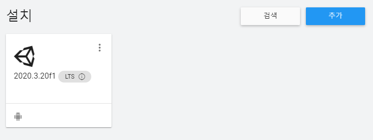
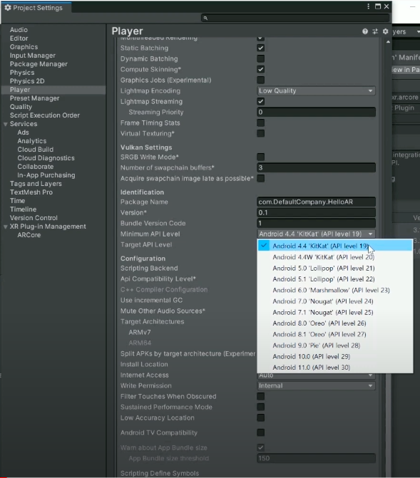
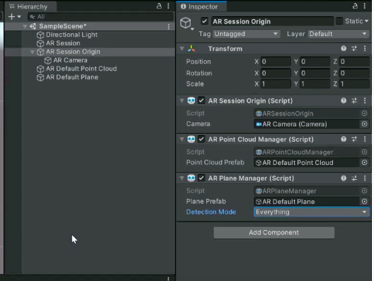
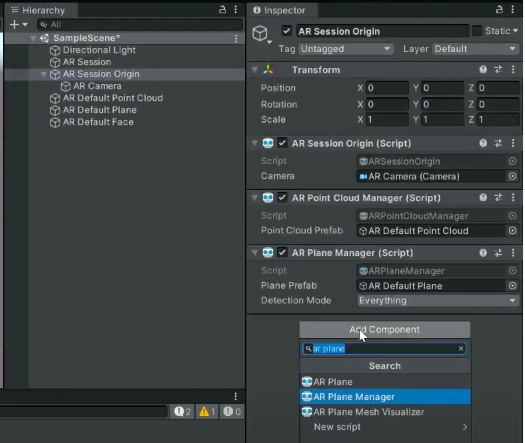

# Unity

### Unity 기본 설치방법

1. Unity Hub 설치

2. 라이선스 : Personal 라이선스로 진행

3. Hub에서 설치탭으로 이동하여 추가버튼을 클릭 => unity패키지 설치(개발하고자하는 플랫폼에 맞춰서)

   

4. 프로젝트 생성 후 실행

### 안드로이드 빌드 - AR필터 제작 초기 설정

1. #### 패키지 설치 : 

   ​	Window -> Package Manager -> UnityRegistry -> (AR Foundatation / ARCore XR Plugin) Install

2. #### Build Setting : 

   1. Platform 선택(개발할 환경에 맞게)

   2. Player 세팅

      1. Graphics APIs - Vulkan 제거

      2. Minimum API Level - 24이상 선택

         

   3. XR Plug-in 세팅

      1. ARCore 체크

3. #### AR Scene 세팅

   1. XR - AR SEssion 추가
   2. XR - AR Session Origin 추가
   3. Main Camera 삭제
   4. AR Camera에 Tag를 Main Camera로 설정

4. #### AR Plane 세팅

   1. XR - AR Default Point Cloud 추가

   2. XR - AR Default Plane 추가

   3. Add Component - AR Point Cloud Manager 추가

   4. AR Default Point Cloud를 Prefeb에 연결

   5. Add Component - AR Plane Manager 추가

   6. AR Default Plane을 Prefeb에 연결

      

5. #### AR Plane 테스트 빌드

   1. File - Build Settings
   2. Add Open Scenes 클릭
   3. Run Device에서 연결된 모바일 선택
   4. Build And Run 클릭

6. #### AR Face 세팅

   1. XR - AR Default Face 추가

   2. Add Component - AR Face Manager 추가

   3. AR Default Face를 Prefeb에 연결

      